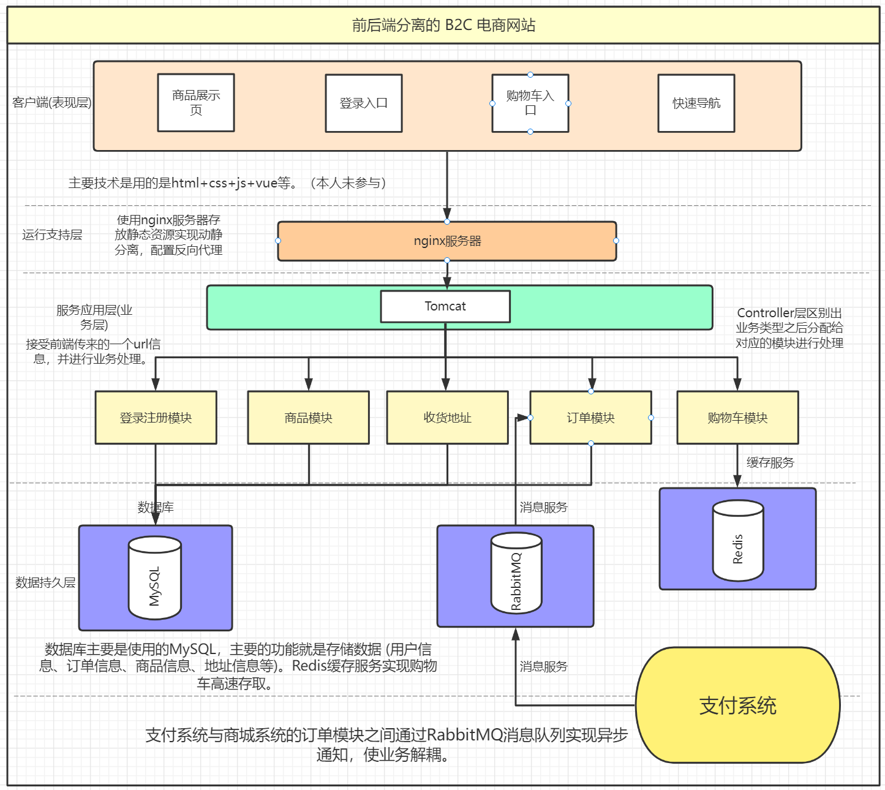
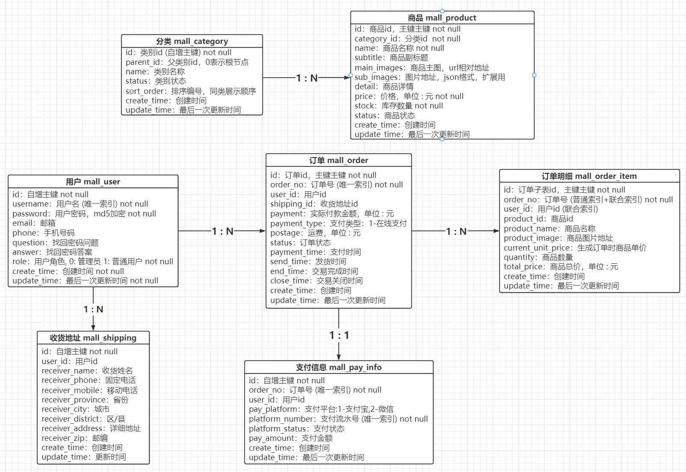
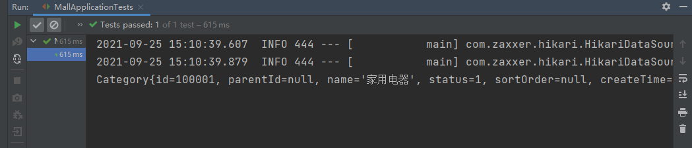
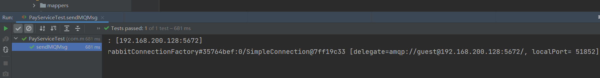

# 前后端分离的 B2C 电商平台+支付系统
> - @author：Kaho WONG
>
> - @create：2021-09

## 前言

本仓库包含了 `mall` 和 `pay` 两个工程，分别对应了该项目的商城系统和通用性支付系统。

> 注意：支付系统的使用需要拥有 `微信支付/支付宝` 的商户资质！


## 项目简介

该项目是一个基于 Spring Boot 的 B2C 全模块电商平台和通用性支付系统的双系统项目，电商平台包含用户、订单、商品、购物车、收货地址等模块，使用 MySQL 作存储层，使用 Redis 存储用户购物车内的商品条目；支付系统采用了微信支付和支付宝开发文档的 api 进行开发，使用 RabbitMQ 实现支付的异步通知；使用 Nginx 服务器实现反向代理和负载均衡。  

> **什么是 B2C ？**
>
> [B2C](https://baike.baidu.com/item/B2C) 中的 B 是 Business，即商业供应方（泛指企业），2（two）则是 to 的谐音，C 是 Consumer，即消费者。B2C 电子商务是按电子商务交易主体划分的一种[电子商务模式](https://baike.baidu.com/item/电子商务模式/10834158)，即表示企业对消费者的电子商务，具体是指通过信息网络以及电子数据信息的方式实现企业或商家机构与消费者之间的各种商务活动、交易活动、金融活动和综合服务活动，是消费者利用 Internet 直接参与经济活动的形式。 

本人主要 负责后端业务逻辑的编写，项目的功能测试，项目架构图、数据库表 E-R 图的绘制以及项目文档的编写。


## 技术栈和环境参数

- Java 1.8
- **SpringBoot 2.1.7**
- MyBatis 2.1.0
- Maven 3.8.1
- MySQL 5.7
- RabbitMQ 3.8.1
- 开发平台：IDEA Ultimate 2021.1
- Nginx
- [best-pay-sdk](https://github.com/Pay-Group/best-pay-sdk)
- 数据库管理软件：SQLyog（看个人喜好）


## 项目背景

本项目主要是我在学习了 Spring Boot、MyBatis、MySQL 等一系列后端技术后，用于初步了解企业级应用系统设计开发流程，学习如何分析开发文档并理解商城系统和支付系统开发场景的前后端分离项目。


## 项目架构图

**项目整体架构：**



**支付系统架构概况：**


**支付全流程示意图（通用）：**


## 项目亮点

**1. 使用 Redis 作为购物车缓存，提高购物车中热点数据的读写效率；**

**2. 引入 RabbitMQ 消息中间件向商城订单模块推送支付消息，实现了订单模块和支付系统的解耦以及交易结果的异步通知；使用RabbitMQ 死信队列解决未支付订单超时自动取消的问题；**

**3. 使用 Nginx 进行动静分离、反向代理和负载均衡；**

**4. 使用开源项目 [Best-Pay-SDK](https://github.com/Pay-Group/best-pay-sdk) 接入微信 Native 支付+支付宝网站支付接口，简化支付调用流程；** 


## 一、数据库设计

### 表设计

**要点：**

- 表关系（重点）
- 表结构
- 唯一索引
- 单索引及组合索引
- not null
- 时间戳


**表关系示意图（E-R 图）：**




> 下面仅仅粗略展示各表大致结构，完整建表 sql 在下面~

**用户表结构：**

```sql
DROP TABLE IF EXISTS `mall_user`;
CREATE TABLE `mall_user` (
  `id` int(11) NOT NULL AUTO_INCREMENT COMMENT '用户表id',
  `username` varchar(50) NOT NULL COMMENT '用户名',
  `password` varchar(50) NOT NULL COMMENT '用户密码，MD5加密',
  `email` varchar(50) DEFAULT NULL,
  `phone` varchar(20) DEFAULT NULL,
  `question` varchar(100) DEFAULT NULL COMMENT '找回密码问题',
  `answer` varchar(100) DEFAULT NULL COMMENT '找回密码答案',
  `role` int(4) NOT NULL COMMENT '角色0-管理员,1-普通用户',
  `create_time` datetime NOT NULL COMMENT '创建时间',
  `update_time` datetime NOT NULL COMMENT '最后一次更新时间',
  PRIMARY KEY (`id`),
  UNIQUE KEY `user_name_unique` (`username`) USING BTREE
) ENGINE=InnoDB DEFAULT CHARSET=utf8;
```

**分类表结构：**

```sql
CREATE TABLE `mall_category`(
 `id` INT(11) NOT NULL AUTO_INCREMENT COMMENT '类别id',
 `parent_id` INT(11) DEFAULT NULL COMMENT '父类别id当id=0时说明是根节点',
 `name` VARCHAR(50) DEFAULT NULL COMMENT '类别名称',
 `status` TINYINT(1) DEFAULT '1' COMMENT '类别状态1-正常，2-已废弃',
 `sort_order` INT(4) DEFAULT NULL COMMENT '排序编号，同类展示顺序',
 `create_time` DATETIME DEFAULT NULL COMMENT '创建时间',
 `update_time` DATETIME DEFAULT NULL COMMENT '更新时间',
 PRIMARY KEY (`id`),
) ENGINE=INNODB AUTO_INCREMENT=1 DEFAULT CHARSET=utf8;
```

**产品表结构：**

```sql
CREATE TABLE `mall_product` (
  `id` int(11) NOT NULL AUTO_INCREMENT COMMENT '商品id',
  `category_id` int(11) NOT NULL COMMENT '分类id,对应mall_category表的主键',
  `name` varchar(100) NOT NULL COMMENT '商品名称',
  `subtitle` varchar(200) DEFAULT NULL COMMENT '商品副标题',
  `main_image` varchar(500) DEFAULT NULL COMMENT '产品主图,url相对地址',
  `sub_images` text COMMENT '图片地址,json格式,扩展用',
  `detail` text COMMENT '商品详情',
  `price` decimal(20,2) NOT NULL COMMENT '价格,单位-元保留两位小数',
  `stock` int(11) NOT NULL COMMENT '库存数量',
  `status` int(6) DEFAULT '1' COMMENT '商品状态.1-在售 2-下架 3-删除',
  `create_time` datetime DEFAULT NULL COMMENT '创建时间',
  `update_time` datetime DEFAULT NULL COMMENT '更新时间',
  PRIMARY KEY (`id`)
) ENGINE=InnoDB DEFAULT CHARSET=utf8;
```

**支付信息表结构：**

```sql
CREATE TABLE `mall_pay_info`(
 `id` INT(11) NOT NULL AUTO_INCREMENT,
 `user_id` INT(11) DEFAULT NULL COMMENT '用户id',
 `order_no` BIGINT(20) DEFAULT NULL COMMENT '订单号',
 `pay_platform` INT(10) DEFAULT NULL COMMENT '支付平台:1-支付宝，2-微信',
 `platform_number` VARCHAR(200) DEFAULT  NULL COMMENT '支付平台订单号',
 `platform_status` VARCHAR(20) DEFAULT NULL COMMENT '支付状态',
 `create_time` DATETIME DEFAULT NULL COMMENT '创建时间',
 `update_time` DATETIME DEFAULT NULL COMMENT '更新时间',
 PRIMARY KEY (`id`),
) ENGINE=INNODB AUTO_INCREMENT=1 DEFAULT CHARSET=utf8;
```

**订单表结构：**

```sql
CREATE TABLE `mall_order` (
  `id` int(11) NOT NULL AUTO_INCREMENT COMMENT '订单id',
  `order_no` bigint(20) DEFAULT NULL COMMENT '订单号',
  `user_id` int(11) DEFAULT NULL COMMENT '用户id',
  `shipping_id` int(11) DEFAULT NULL,
  `payment` decimal(20,2) DEFAULT NULL COMMENT '实际付款金额,单位是元,保留两位小数',
  `payment_type` int(4) DEFAULT NULL COMMENT '支付类型,1-在线支付',
  `postage` int(10) DEFAULT NULL COMMENT '运费,单位是元',
  `status` int(10) DEFAULT NULL COMMENT '订单状态:0-已取消-10-未付款，20-已付款，40-已发货，50-交易成功，60-交易关闭',
  `payment_time` datetime DEFAULT NULL COMMENT '支付时间',
  `send_time` datetime DEFAULT NULL COMMENT '发货时间',
  `end_time` datetime DEFAULT NULL COMMENT '交易完成时间',
  `close_time` datetime DEFAULT NULL COMMENT '交易关闭时间',
  `create_time` datetime DEFAULT NULL COMMENT '创建时间',
  `update_time` datetime DEFAULT NULL COMMENT '更新时间',
  PRIMARY KEY (`id`),
  UNIQUE KEY `order_no_index` (`order_no`) USING BTREE
) ENGINE=InnoDB DEFAULT CHARSET=utf8;
```

user_id 是用户id，即用户表的主键，所以在本订单表中 user_id 是充当外键的作用，这就能保证数据一致性和节省存储空间，可以这么理解：商城系统订单表存储一个用户 ID 作为关联外键，而不推荐存储完整的用户信息，因为当我们用户表中的信息（真实名称、手机号、收货地址···）修改后，不需要再次维护订单表的用户数据，同时也节省了存储空间。 


**订单明细表结构：**

```sql
CREATE TABLE `mall_order_item` (
  `id` int(11) NOT NULL AUTO_INCREMENT COMMENT '订单子表id',
  `user_id` int(11) DEFAULT NULL,
  `order_no` bigint(20) DEFAULT NULL,
  `product_id` int(11) DEFAULT NULL COMMENT '商品id',
  `product_name` varchar(100) DEFAULT NULL COMMENT '商品名称',
  `product_image` varchar(500) DEFAULT NULL COMMENT '商品图片地址',
  `current_unit_price` decimal(20,2) DEFAULT NULL COMMENT '生成订单时的商品单价，单位是元,保留两位小数',
  `quantity` int(10) DEFAULT NULL COMMENT '商品数量',
  `total_price` decimal(20,2) DEFAULT NULL COMMENT '商品总价,单位是元,保留两位小数',
  `create_time` datetime DEFAULT NULL,
  `update_time` datetime DEFAULT NULL,
  PRIMARY KEY (`id`),
  KEY `order_no_index` (`order_no`) USING BTREE,
  KEY `order_no_user_id_index` (`user_id`,`order_no`) USING BTREE
) ENGINE=InnoDB DEFAULT CHARSET=utf8;
```

**收货地址表结构：**

```sql
CREATE TABLE `mall_shipping` (
  `id` int(11) NOT NULL AUTO_INCREMENT,
  `user_id` int(11) DEFAULT NULL COMMENT '用户id',
  `receiver_name` varchar(20) DEFAULT NULL COMMENT '收货姓名',
  `receiver_phone` varchar(20) DEFAULT NULL COMMENT '收货固定电话',
  `receiver_mobile` varchar(20) DEFAULT NULL COMMENT '收货移动电话',
  `receiver_province` varchar(20) DEFAULT NULL COMMENT '省份',
  `receiver_city` varchar(20) DEFAULT NULL COMMENT '城市',
  `receiver_district` varchar(20) DEFAULT NULL COMMENT '区/县',
  `receiver_address` varchar(200) DEFAULT NULL COMMENT '详细地址',
  `receiver_zip` varchar(6) DEFAULT NULL COMMENT '邮编',
  `create_time` datetime DEFAULT NULL,
  `update_time` datetime DEFAULT NULL,
  PRIMARY KEY (`id`)
) ENGINE=InnoDB DEFAULT CHARSET=utf8;
```

**支付信息表：**

```sql
CREATE TABLE `mall_pay_info` (
  `id` int(11) NOT NULL AUTO_INCREMENT,
  `user_id` int(11) DEFAULT NULL COMMENT '用户id',
  `order_no` bigint(20) NOT NULL COMMENT '订单号',
  `pay_platform` int(10) DEFAULT NULL COMMENT '支付平台:1-支付宝,2-微信',
  `platform_number` varchar(200) DEFAULT NULL COMMENT '支付流水号',
  `platform_status` varchar(20) DEFAULT NULL COMMENT '支付状态',
  `pay_amount` decimal(20,2) NOT NULL COMMENT '支付金额',
  `create_time` datetime DEFAULT CURRENT_TIMESTAMP COMMENT '创建时间',
  `update_time` datetime DEFAULT CURRENT_TIMESTAMP ON UPDATE CURRENT_TIMESTAMP COMMENT '更新时间',
  PRIMARY KEY (`id`),
  UNIQUE KEY `uqe_order_no` (`order_no`),
  UNIQUE KEY `uqe_platform_number` (`platform_number`)
) ENGINE=InnoDB AUTO_INCREMENT=1 DEFAULT CHARSET=utf8;
```


**TIPS：**

**1. 主键索引**

默认会对主键创建聚簇索引，在工程中主要是几张表中的 `XX_id` 字段，同时声明了自增属性，无需我们手动赋值。

**2. 唯一索引**

保证数据唯一性，同时提高在数据库的检索效率。

**3. 单索引及组合索引**

通过 B+ 树提高针对特定字段的查询速度。组合索引符合最左前缀原则，减少创建的索引数量，降低数据库维护成本。

**4. 时间戳**

便于查业务问题

- create_time: 创建时间 
- update_time: 更新时间


### 建立数据库

- 安装Mysql
- 执行建表SQL


**建表SQL**

本项目建表SQL如下：**mall.sql**

```sql
DROP TABLE IF EXISTS `mall_category`;
CREATE TABLE `mall_category` (
  `id` int(11) NOT NULL AUTO_INCREMENT COMMENT '类别Id',
  `parent_id` int(11) DEFAULT NULL COMMENT '父类别id当id=0时说明是根节点,一级类别',
  `name` varchar(50) DEFAULT NULL COMMENT '类别名称',
  `status` tinyint(1) DEFAULT '1' COMMENT '类别状态1-正常,2-已废弃',
  `sort_order` int(4) DEFAULT NULL COMMENT '排序编号,同类展示顺序,数值相等则自然排序',
  `create_time` datetime DEFAULT NULL COMMENT '创建时间',
  `update_time` datetime DEFAULT NULL COMMENT '更新时间',
  PRIMARY KEY (`id`)
) ENGINE=InnoDB DEFAULT CHARSET=utf8;


INSERT INTO `mall_category` (`id`, `parent_id`, `name`, `status`, `sort_order`, `create_time`, `update_time`)
VALUES
	(100001,0,'家用电器',1,NULL,'2000-03-25 16:46:00','2000-03-25 16:46:00'),
	(100002,0,'数码3C',1,NULL,'2000-03-25 16:46:21','2000-03-25 16:46:21'),
	(100003,0,'服装箱包',1,NULL,'2000-03-25 16:49:53','2000-03-25 16:49:53'),
	(100004,0,'食品生鲜',1,NULL,'2000-03-25 16:50:19','2000-03-25 16:50:19'),
	(100005,0,'酒水饮料',1,NULL,'2000-03-25 16:50:29','2000-03-25 16:50:29'),
	(100006,100001,'冰箱',1,NULL,'2000-03-25 16:52:15','2000-03-25 16:52:15'),
	(100007,100001,'电视',1,NULL,'2000-03-25 16:52:26','2000-03-25 16:52:26'),
	(100008,100001,'洗衣机',1,NULL,'2000-03-25 16:52:39','2000-03-25 16:52:39'),
	(100009,100001,'空调',1,NULL,'2000-03-25 16:52:45','2000-03-25 16:52:45'),
	(100010,100001,'电热水器',1,NULL,'2000-03-25 16:52:54','2000-03-25 16:52:54'),
	(100011,100002,'电脑',1,NULL,'2000-03-25 16:53:18','2000-03-25 16:53:18'),
	(100012,100002,'手机',1,NULL,'2000-03-25 16:53:27','2000-03-25 16:53:27'),
	(100013,100002,'平板电脑',1,NULL,'2000-03-25 16:53:35','2000-03-25 16:53:35'),
	(100014,100002,'数码相机',1,NULL,'2000-03-25 16:53:56','2000-03-25 16:53:56'),
	(100015,100002,'3C配件',1,NULL,'2000-03-25 16:54:07','2000-03-25 16:54:07'),
	(100016,100003,'女装',1,NULL,'2000-03-25 16:54:44','2000-03-25 16:54:44'),
	(100017,100003,'帽子',1,NULL,'2000-03-25 16:54:51','2000-03-25 16:54:51'),
	(100018,100003,'旅行箱',1,NULL,'2000-03-25 16:55:02','2000-03-25 16:55:02'),
	(100019,100003,'手提包',1,NULL,'2000-03-25 16:55:09','2000-03-25 16:55:09'),
	(100020,100003,'保暖内衣',1,NULL,'2000-03-25 16:55:18','2000-03-25 16:55:18'),
	(100021,100004,'零食',1,NULL,'2000-03-25 16:55:30','2000-03-25 16:55:30'),
	(100022,100004,'生鲜',1,NULL,'2000-03-25 16:55:37','2000-03-25 16:55:37'),
	(100023,100004,'半成品菜',1,NULL,'2000-03-25 16:55:47','2000-03-25 16:55:47'),
	(100024,100004,'速冻食品',1,NULL,'2000-03-25 16:55:56','2000-03-25 16:55:56'),
	(100025,100004,'进口食品',1,NULL,'2000-03-25 16:56:06','2000-03-25 16:56:06'),
	(100026,100005,'白酒',1,NULL,'2000-03-25 16:56:22','2000-03-25 16:56:22'),
	(100027,100005,'红酒',1,NULL,'2000-03-25 16:56:30','2000-03-25 16:56:30'),
	(100028,100005,'饮料',1,NULL,'2000-03-25 16:56:37','2000-03-25 16:56:37'),
	(100029,100005,'调制鸡尾酒',1,NULL,'2000-03-25 16:56:45','2000-03-25 16:56:45'),
	(100030,100005,'进口洋酒',1,NULL,'2000-03-25 16:57:05','2000-03-25 16:57:05');


DROP TABLE IF EXISTS `mall_order`;
CREATE TABLE `mall_order` (
  `id` int(11) NOT NULL AUTO_INCREMENT COMMENT '订单id',
  `order_no` bigint(20) DEFAULT NULL COMMENT '订单号',
  `user_id` int(11) DEFAULT NULL COMMENT '用户id',
  `shipping_id` int(11) DEFAULT NULL,
  `payment` decimal(20,2) DEFAULT NULL COMMENT '实际付款金额,单位是元,保留两位小数',
  `payment_type` int(4) DEFAULT NULL COMMENT '支付类型,1-在线支付',
  `postage` int(10) DEFAULT NULL COMMENT '运费,单位是元',
  `status` int(10) DEFAULT NULL COMMENT '订单状态:0-已取消-10-未付款，20-已付款，40-已发货，50-交易成功，60-交易关闭',
  `payment_time` datetime DEFAULT NULL COMMENT '支付时间',
  `send_time` datetime DEFAULT NULL COMMENT '发货时间',
  `end_time` datetime DEFAULT NULL COMMENT '交易完成时间',
  `close_time` datetime DEFAULT NULL COMMENT '交易关闭时间',
  `create_time` datetime DEFAULT NULL COMMENT '创建时间',
  `update_time` datetime DEFAULT NULL COMMENT '更新时间',
  PRIMARY KEY (`id`),
  UNIQUE KEY `order_no_index` (`order_no`) USING BTREE
) ENGINE=InnoDB DEFAULT CHARSET=utf8;

CREATE TABLE `mall_order_item` (
  `id` int(11) NOT NULL AUTO_INCREMENT COMMENT '订单子表id',
  `user_id` int(11) DEFAULT NULL,
  `order_no` bigint(20) DEFAULT NULL,
  `product_id` int(11) DEFAULT NULL COMMENT '商品id',
  `product_name` varchar(100) DEFAULT NULL COMMENT '商品名称',
  `product_image` varchar(500) DEFAULT NULL COMMENT '商品图片地址',
  `current_unit_price` decimal(20,2) DEFAULT NULL COMMENT '生成订单时的商品单价，单位是元,保留两位小数',
  `quantity` int(10) DEFAULT NULL COMMENT '商品数量',
  `total_price` decimal(20,2) DEFAULT NULL COMMENT '商品总价,单位是元,保留两位小数',
  `create_time` datetime DEFAULT NULL,
  `update_time` datetime DEFAULT NULL,
  PRIMARY KEY (`id`),
  KEY `order_no_index` (`order_no`) USING BTREE,
  KEY `order_no_user_id_index` (`user_id`,`order_no`) USING BTREE
) ENGINE=InnoDB DEFAULT CHARSET=utf8;

DROP TABLE IF EXISTS `mall_pay_info`;
CREATE TABLE `mall_pay_info` (
  `id` int(11) NOT NULL AUTO_INCREMENT,
  `user_id` int(11) DEFAULT NULL COMMENT '用户id',
  `order_no` bigint(20) DEFAULT NULL COMMENT '订单号',
  `pay_platform` int(10) DEFAULT NULL COMMENT '支付平台:1-支付宝,2-微信',
  `platform_number` varchar(200) DEFAULT NULL COMMENT '支付宝支付流水号',
  `platform_status` varchar(20) DEFAULT NULL COMMENT '支付宝支付状态',
  `create_time` datetime DEFAULT NULL COMMENT '创建时间',
  `update_time` datetime DEFAULT NULL COMMENT '更新时间',
  PRIMARY KEY (`id`)
) ENGINE=InnoDB DEFAULT CHARSET=utf8;


DROP TABLE IF EXISTS `mall_product`;
CREATE TABLE `mall_product` (
  `id` int(11) NOT NULL AUTO_INCREMENT COMMENT '商品id',
  `category_id` int(11) NOT NULL COMMENT '分类id,对应mall_category表的主键',
  `name` varchar(100) NOT NULL COMMENT '商品名称',
  `subtitle` varchar(200) DEFAULT NULL COMMENT '商品副标题',
  `main_image` varchar(500) DEFAULT NULL COMMENT '产品主图,url相对地址',
  `sub_images` text COMMENT '图片地址,json格式,扩展用',
  `detail` text COMMENT '商品详情',
  `price` decimal(20,2) NOT NULL COMMENT '价格,单位-元保留两位小数',
  `stock` int(11) NOT NULL COMMENT '库存数量',
  `status` int(6) DEFAULT '1' COMMENT '商品状态.1-在售 2-下架 3-删除',
  `create_time` datetime DEFAULT NULL COMMENT '创建时间',
  `update_time` datetime DEFAULT NULL COMMENT '更新时间',
  PRIMARY KEY (`id`)
) ENGINE=InnoDB DEFAULT CHARSET=utf8;

INSERT INTO `mall_product` (`id`, `category_id`, `name`, `subtitle`, `main_image`, `sub_images`, `detail`, `price`, `stock`, `status`, `create_time`, `update_time`)
VALUES
	(26,100002,'Apple iPhone 7 Plus (A1661) 128G 玫瑰金色 移动联通电信4G手机','iPhone 7，现更以红色呈现。','http://img.springboot.cn/241997c4-9e62-4824-b7f0-7425c3c28917.jpeg','241997c4-9e62-4824-b7f0-7425c3c28917.jpeg,b6c56eb0-1748-49a9-98dc-bcc4b9788a54.jpeg,92f17532-1527-4563-aa1d-ed01baa0f7b2.jpeg,3adbe4f7-e374-4533-aa79-cc4a98c529bf.jpeg','<p><br></p><p><br></p><p><br></p><p><br></p><p><br></p><p><br></p><p><br></p><p><br></p><p><br></p><p><br></p><p><br></p>',6999.00,96,1,NULL,'2000-04-13 21:45:41'),
	(27,100006,'Midea/美的 BCD-535WKZM(E)冰箱双开门对开门风冷无霜智能电家用','送品牌烤箱，五一大促','http://img.springboot.cn/ac3e571d-13ce-4fad-89e8-c92c2eccf536.jpeg','ac3e571d-13ce-4fad-89e8-c92c2eccf536.jpeg,4bb02f1c-62d5-48cc-b358-97b05af5740d.jpeg,36bdb49c-72ae-4185-9297-78829b54b566.jpeg','<p><br></p><p><br></p>',3299.00,99,1,'2000-04-13 18:51:54','2000-04-13 21:45:41'),
	(28,100012,'4+64G送手环/Huawei/华为 nova 手机P9/P10plus青春','NOVA青春版1999元','http://img.springboot.cn/0093f5d3-bdb4-4fb0-bec5-5465dfd26363.jpeg','0093f5d3-bdb4-4fb0-bec5-5465dfd26363.jpeg,13da2172-4445-4eb5-a13f-c5d4ede8458c.jpeg,58d5d4b7-58d4-4948-81b6-2bae4f79bf02.jpeg','<p><br></p>',1999.00,100,1,'2000-04-13 18:57:18','2000-04-13 21:45:41'),
	(29,100008,'Haier/海尔HJ100-1HU1 10公斤滚筒洗衣机全自动带烘干家用大容量 洗烘一体','门店机型 德邦送货','http://img.springboot.cn/173335a4-5dce-4afd-9f18-a10623724c4e.jpeg','173335a4-5dce-4afd-9f18-a10623724c4e.jpeg,42b1b8bc-27c7-4ee1-80ab-753d216a1d49.jpeg,2f1b3de1-1eb1-4c18-8ca2-518934931bec.jpeg','<p><br></p>',4299.00,100,1,'2000-04-13 19:07:47','2000-04-13 21:45:41');

DROP TABLE IF EXISTS `mall_shipping`;
CREATE TABLE `mall_shipping` (
  `id` int(11) NOT NULL AUTO_INCREMENT,
  `user_id` int(11) DEFAULT NULL COMMENT '用户id',
  `receiver_name` varchar(20) DEFAULT NULL COMMENT '收货姓名',
  `receiver_phone` varchar(20) DEFAULT NULL COMMENT '收货固定电话',
  `receiver_mobile` varchar(20) DEFAULT NULL COMMENT '收货移动电话',
  `receiver_province` varchar(20) DEFAULT NULL COMMENT '省份',
  `receiver_city` varchar(20) DEFAULT NULL COMMENT '城市',
  `receiver_district` varchar(20) DEFAULT NULL COMMENT '区/县',
  `receiver_address` varchar(200) DEFAULT NULL COMMENT '详细地址',
  `receiver_zip` varchar(6) DEFAULT NULL COMMENT '邮编',
  `create_time` datetime DEFAULT NULL,
  `update_time` datetime DEFAULT NULL,
  PRIMARY KEY (`id`)
) ENGINE=InnoDB DEFAULT CHARSET=utf8;

INSERT INTO `mall_shipping` (`id`, `user_id`, `receiver_name`, `receiver_phone`, `receiver_mobile`, `receiver_province`, `receiver_city`, `receiver_district`, `receiver_address`, `receiver_zip`, `create_time`, `update_time`)
VALUES
	(4,1,'Mars','010','18688888888','广东','深圳市','南山区','深圳大学','100000','2000-01-22 14:26:25','2001-04-22 14:26:25');

DROP TABLE IF EXISTS `mall_user`;
CREATE TABLE `mall_user` (
  `id` int(11) NOT NULL AUTO_INCREMENT COMMENT '用户表id',
  `username` varchar(50) NOT NULL COMMENT '用户名',
  `password` varchar(50) NOT NULL COMMENT '用户密码，MD5加密',
  `email` varchar(50) DEFAULT NULL,
  `phone` varchar(20) DEFAULT NULL,
  `question` varchar(100) DEFAULT NULL COMMENT '找回密码问题',
  `answer` varchar(100) DEFAULT NULL COMMENT '找回密码答案',
  `role` int(4) NOT NULL COMMENT '角色0-管理员,1-普通用户',
  `create_time` datetime NOT NULL COMMENT '创建时间',
  `update_time` datetime NOT NULL COMMENT '最后一次更新时间',
  PRIMARY KEY (`id`),
  UNIQUE KEY `user_name_unique` (`username`) USING BTREE
) ENGINE=InnoDB DEFAULT CHARSET=utf8;

INSERT INTO `mall_user` (`id`, `username`, `password`, `email`, `phone`, `question`, `answer`, `role`, `create_time`, `update_time`)
VALUES
	(1,'admin','21232F297A57A5A743894A0E4A801FC3','admin@qq.com',NULL,NULL,NULL,0,'2000-08-06 15:12:00','2000-08-06 15:12:00');

-- 新增“支付金额”字段 xxxx年xx月xx日
alter table mall_pay_info add pay_amount decimal(20,2) NOT NULL COMMENT '支付金额' after platform_status;

-- 后续修改mall_pay_info，修改后如下
DROP TABLE IF EXISTS `mall_pay_info`;
CREATE TABLE `mall_pay_info` (
  `id` int(11) NOT NULL AUTO_INCREMENT,
  `user_id` int(11) DEFAULT NULL COMMENT '用户id',
  `order_no` bigint(20) NOT NULL COMMENT '订单号',
  `pay_platform` int(10) DEFAULT NULL COMMENT '支付平台:1-支付宝,2-微信',
  `platform_number` varchar(200) DEFAULT NULL COMMENT '支付流水号',
  `platform_status` varchar(20) DEFAULT NULL COMMENT '支付状态',
  `pay_amount` decimal(20,2) NOT NULL COMMENT '支付金额',
  `create_time` datetime DEFAULT CURRENT_TIMESTAMP COMMENT '创建时间',
  `update_time` datetime DEFAULT CURRENT_TIMESTAMP ON UPDATE CURRENT_TIMESTAMP COMMENT '更新时间',
  PRIMARY KEY (`id`),
  UNIQUE KEY `uqe_order_no` (`order_no`),
  UNIQUE KEY `uqe_platform_number` (`platform_number`)
) ENGINE=InnoDB AUTO_INCREMENT=1 DEFAULT CHARSET=utf8;

-- 后续修改mall_user表字段结构
alter table mall_user modify create_time datetime NOT NULL DEFAULT CURRENT_TIMESTAMP COMMENT '创建时间';
alter table mall_user modify update_time datetime NOT NULL DEFAULT CURRENT_TIMESTAMP ON UPDATE CURRENT_TIMESTAMP COMMENT '最后一次更新时间';

```


将上述 `mall.sql` 直接粘贴到数据库软件（SQLyog）中执行，建表成功如图：


## 二、SpringBoot 2.1.7 项目初始化

创建SpringBoot项目有如下三种创建方法：

1. Intellij IDEA Ultimate
2. Spring 官网
3. Maven

推荐使用第一种，找不到需要的 2.1.7 版本可以先用最新的版本，等工程构建好后进入 pom.xml 文件把`spring-boot-starter-parent`的版本改成`2.1.7.RELEASE` 。

在 IDEA 中新建 mall 工程作为本项目的**商城后端系统**。

初始化后生成项目结构：


下面是初始的 pom.xml 文件：

**记得把版本改为 2.1.7.RELEASE**

```xml
<?xml version="1.0" encoding="UTF-8"?>
<project xmlns="http://maven.apache.org/POM/4.0.0" xmlns:xsi="http://www.w3.org/2001/XMLSchema-instance"
         xsi:schemaLocation="http://maven.apache.org/POM/4.0.0 https://maven.apache.org/xsd/maven-4.0.0.xsd">
    <modelVersion>4.0.0</modelVersion>
    <parent>
        <groupId>org.springframework.boot</groupId>
        <artifactId>spring-boot-starter-parent</artifactId>
        <version>2.1.7.RELEASE</version>
        <relativePath/> <!-- lookup parent from repository -->
    </parent>
    <groupId>com.mars</groupId>
    <artifactId>mall</artifactId>
    <version>0.0.1-SNAPSHOT</version>
    <name>mall</name>
    <description>Demo project for Spring Boot</description>
    <properties>
        <java.version>1.8</java.version>
    </properties>
    <dependencies>
        <!--SpringBoot的Web场景启动器-->
        <dependency>
            <groupId>org.springframework.boot</groupId>
            <artifactId>spring-boot-starter-web</artifactId>
        </dependency>
		<!--测试场景启动器-->
        <dependency>
            <groupId>org.springframework.boot</groupId>
            <artifactId>spring-boot-starter-test</artifactId>
            <scope>test</scope>
        </dependency>

    </dependencies>

    <build>
        <plugins>
            <plugin>
                <groupId>org.springframework.boot</groupId>
                <artifactId>spring-boot-maven-plugin</artifactId>
            </plugin>
        </plugins>
    </build>

</project>
```


**MallApplication.java：**


然后进入test目录下的MallApplicationTests，将里面的 import 改成：`import org.junit.Test;`


> 如果不进行改动，等会启动项目时会报错 “java: 程序包org.junit.jupiter.api不存在”


现在启动项目：


到这里项目初步构建成功~~~


## 三、相关配置

本项目在数据访问层（DAO）使用的是 MyBatis 框架。

在 pom.xml 中导入 mybatis 2.1.0 和 mysql 的依赖：

```xml
		<!--mybatis 2.1.0 依赖-->
        <dependency>
            <groupId>org.mybatis.spring.boot</groupId>
            <artifactId>mybatis-spring-boot-starter</artifactId>
            <version>2.1.0</version>
        </dependency>
        <!--mysql依赖，不用加版本号，parent工程底层会自动配置版本-->
        <dependency>
            <groupId>mysql</groupId>
            <artifactId>mysql-connector-java</artifactId>
        </dependency>
```


**将工程原本自带的 application.properties 文件修改成 application.yml 格式**，这是目前更为主流的一种配置方式。


### 1. 测试 MySQL 连接

> 注意：目前阶段只是测试工程是否能够顺利使用 mysql 连接，下面编写的部分代码用于测试连接

测试工程是否能连接上mysql，用mybatis进行查询：

在 application.yml 配置文件中进行对 mysql jdbc 连接的配置，如下：

```yml
spring:
  datasource:
    driver-class-name: com.mysql.cj.jdbc.Driver
    username: root
    password: wjh1316156936
    url: jdbc:mysql://localhost:3306/mall_db?characterEncoding=utf-8&useSSL=false&serverTimezone=GMT
```

**注意：**这里在 **url** 后面一定要加上 **&serverTimezone=GMT** ，没有加的话会报错：`The server time zone value '�й���׼ʱ��' is unrecognized or represents more than one time zone.`


在 mall 包创建一个 pojo 包，在其中创建一个pojo类 Category：

```java
package com.mars.mall.pojo;

import java.util.Date;

/**
 * po(persistent object)
 * pojo(plian ordinary java object)
 *
 * @description: 商品类别类
 * @author: Mars
 * @create: 2021-09-25 14:44
 **/
public class Category {

    private Integer id;     //类别id
    private Integer parentId;      //父类别id
    private String name;        //类别名称
    private Integer status;     //类别状态
    private Integer sortOrder;      //排序编号
    private Date createTime;        //创建时间
    private Date updateTime;        //更新时间

    //getter、setter、toString方法
}
```

在 mall 包下创建 dao 包，在其中创建 CategoryMapper：

```java
package com.mars.mall.dao;

import com.mars.mall.pojo.Category;
import org.apache.ibatis.annotations.Mapper;
import org.apache.ibatis.annotations.Param;
import org.apache.ibatis.annotations.Select;

/**
 * @description: 商品类别类的Mapper接口
 * @author: Mars
 * @create: 2021-09-25 14:52
 **/
@Mapper
public interface CategoryMapper {
	//@Select(....)注解的作用就是告诉mybatis框架,执行括号内的sql语句
    @Select("select * from mall_category where id = #{id}")
    Category findById(@Param("id") Integer id);//在方法参数的前面写上@Param("参数名"),表示给参数命名,名称就是括号中的内容
}
```

直接使用注解完成 mapper.xml 文件的功能，省去了不少麻烦~但是企业中大部分还是使用xml方式，项目后面也是使用xml方式完成MyBatis功能配置。


在Test包下编写测试类：

```java
package com.mars.mall;

import com.mars.mall.dao.CategoryMapper;
import com.mars.mall.pojo.Category;
import org.junit.Test;
import org.junit.runner.RunWith;
import org.springframework.beans.factory.annotation.Autowired;
import org.springframework.boot.test.context.SpringBootTest;
import org.springframework.test.context.junit4.SpringRunner;

@RunWith(SpringRunner.class)
@SpringBootTest
public class MallApplicationTests {

    @Autowired
    private CategoryMapper categoryMapper;

    @Test
    public void contextLoads() {
        Category category = categoryMapper.findById(100001);
        System.out.println(category.toString());
    }

}
```


运行测试类，查询到结果：



则项目能够连接上mysql使用mybatis完成dao层的功能~


> 需要注意的来了，**在查询到的结果中，很多字段明明在数据库是有给定值的，但查询结果却都是null。说明字段没有对应上**。为了解决这种问题，需要在 application.yml 配置文件中进行配置：

```yml
mybatis:
  configuration:
    map-underscore-to-camel-case: true
```

这个配置的作用是**让mybatis自动将数据库中的字段与pojo类中的属性进行一一对应**

这样，查询出来的结果便是正常的：

```
2021-09-25 15:23:56.117  INFO 21000 --- [           main] com.zaxxer.hikari.HikariDataSource       : HikariPool-1 - Starting...
2021-09-25 15:23:56.407  INFO 21000 --- [           main] com.zaxxer.hikari.HikariDataSource       : HikariPool-1 - Start completed.
Category{id=100001, parentId=0, name='家用电器', status=1, sortOrder=null, createTime=Sun Mar 26 00:46:00 CST 2000, updateTime=Sun Mar 26 00:46:00 CST 2000}
```


**tips：**

如果每张表的Mapper接口都要加上 `@Mapper` 是不是会有点麻烦呢？


其实可以将 Mapper 接口上的注解去掉，然后在SpringBoot主类上加上 `@MapperScan(basePackages = "com.mars.mall.dao")`，这样便可以为`com.mars.mall.dao` 包下的所有 Mapper 接口在容器中自动创建对应的mapper实例：


程序照样可以执行成功。这样便省去了在每一个 Mapper 接口上声明 `@Mapper` 注解的麻烦了。但是要注意，这可能会使程序某处爆红（出错），但不影响结果：


### 2. IDEA 配置

以下三个设置可以提升开发效率：

- Maven依赖自动刷新
- 自动导包
- Lombok

#### 2.1 Maven 依赖自动刷新

很可惜，2021.1版本的IDEA取消了设置 Maven 自动刷新的选项~


#### 2.2 自动导包

进入**settings——editor——general——auto import**，勾选这两项


> 只有一个的包会自动导入，但存在多个同名的包需要自己手动选择


#### 2.3 Lombok

一般我们编写 pojo 类时，需要添加get、set、tostring方法，极其费事，而且如果有一个属性临时修改，我们不得不逐个方法一起修改，这样更加浪费时间。使用 **Lombok** 可以将我们从繁杂的配置 pojo 类方法的过程中解放出来，具体步骤如下：

1. 首先，将之前pojo类 Category 中编写的 get、set、tostring 全部删掉：


2. 在 pom.xml 中引入lombok依赖：


3. 再在IEDA插件市场下载lombok插件，但是我发现 IDEA 2021.1 的插件市场找不到 lombok 插件，但是能使用 lombok 的功能，只要在使用其注解的时候导入lombok的包就能使用，如图：


## 四、MyBatis xml方式使用梳理

先来一个小贴士（非必要）：如果觉得每次运行程序时控制台输出的东西太多太乱，可以在application.yml文件中添加下面的配置，可以**简化日志的输出**：

```yml
logging:
  pattern:
    console: "[%thread] %-5level %logger{36} - %msg%n"
```

### 1. 新建 mapper.xml

首先，在resources包下创建一个mappers包，新建一个mapper文件：


> 要注意，如果该mapper文件创建在与dao同个包下，则不需要特别告知程序这个文件的位置，而因为我将这个文件放在了resourses下，所以需要特别在配置文件application.yml下进行配置：（否则会报错）


这样程序才能找到mapper.xml文件。

### 2. 在 dao 包下的 mapper 接口中声明方法

编写mapper方法：


### 3. 编写 mapper.xml 文件

编写mapper文件：

```xml
<?xml version="1.0" encoding="UTF-8" ?>
<!DOCTYPE mapper
        PUBLIC "-//mybatis.org//DTD Mapper 3.0//EN"
        "http://mybatis.org/dtd/mybatis-3-mapper.dtd">
<mapper namespace="com.mars.mall.dao.CategoryMapper">
    <!--作为公用的sql句段使用-->
    <sql id="Base_Column_List">
        id, parent_id, name, status, sort_order, create_time, update_time
    </sql>

    <select id="queryById" resultType="com.mars.mall.pojo.Category">
        select 
        <include refid="Base_Column_List" />
        from mall_category
        where id = #{id}
    </select>
</mapper>
```

> 尽量不要用 * 进行查询。因为消耗比覆盖查询大很多，在查询到需要的字段后多数情况下不得不回表查询，增加消耗！

接下来就可以运行了，编写测试方法并测试：


一般我们对一个模块进行测试，都会单独建一个测试类，而非全部测试写在同一个test中，所以这里也这样做：

首先在要进行测试的类的空白处右击并选择生成Test（Ctrl + Shift + T）：


进行相关配置：


便自动在test包下生成了对应的test类：


现在将原先 MallApplicationTests 类中的测试方法迁移进刚刚生成的test类，并**让新的test类继承于MallApplicationTests 【这是为了让新生成的测试类也继承到@RunWith(SpringRunner.class)、@SpringBootTest两个注解，能够被springboot识别】**

原测试类清空：


单一模块测试类：


运行正常：


## 五、MyBatis 三剑客

- MyBatis-generator
- MyBatis-plugin
- MyBatis-PageHelper


### 1. MyBatis-generator

在使用Mybatis的时候，dao接口、pojo实体类、还有每个实体类对应的xml如果都得自己写，这个工作量也是蛮大的，而插件Mybatis-generator就是用来自动生成这些代码的 

在 pom.xml 中添加插件：


在终端中输入命令：


因为终端提示 `在mall\src\main\resources目录下generatorConfig.xml文件不存在`，所以要先把这个文件创建了：

在resources目录下创建 **generatorConfig.xml**，文件中的内容可以在mybatis官方文档找，也可以上网找，配置详解如下：

```xml
<?xml version="1.0" encoding="UTF-8"?>
<!DOCTYPE generatorConfiguration
        PUBLIC "-//mybatis.org//DTD MyBatis Generator Configuration 1.0//EN"
        "http://mybatis.org/dtd/mybatis-generator-config_1_0.dtd">
<!-- 配置生成器 -->
<generatorConfiguration>
    <!-- 可以用于加载配置项或者配置文件，在整个配置文件中就可以使用${propertyKey}的方式来引用配置项
        resource：配置资源加载地址，使用resource，MBG从classpath开始找，比如com/myproject/generatorConfig.properties
        url：配置资源加载地质，使用URL的方式，比如file:///C:/myfolder/generatorConfig.properties.
        注意，两个属性只能选址一个;

        另外，如果使用了mybatis-generator-maven-plugin，那么在pom.xml中定义的properties都可以直接在generatorConfig.xml中使用
    <properties resource="" url="" />
     -->

    <!-- 在MBG工作的时候，需要额外加载的依赖包
       location属性指明加载jar/zip包的全路径
   <classPathEntry location="/Program Files/IBM/SQLLIB/java/db2java.zip" />
     -->

    <!--
        context:生成一组对象的环境
        id:必选，上下文id，用于在生成错误时提示
        defaultModelType:指定生成对象的样式
            1，conditional：类似hierarchical；如果某张表只有一个字段，则不会生成改实体
            2，flat：所有内容（主键，blob）等全部生成在一个对象中；常用
            3，hierarchical：主键生成一个XXKey对象(key class)，Blob等单独生成一个对象，其他简单属性在一个对象中(record class)
        targetRuntime:
            1，MyBatis3：默认的值，生成基于MyBatis3.x以上版本的内容，包括XXXBySample；
            2，MyBatis3Simple：类似MyBatis3，只是不生成XXXBySmple；
        introspectedColumnImpl：类全限定名，用于扩展MBG
    -->
    <context id="mysql" defaultModelType="flat" targetRuntime="MyBatis3" >


        <!-- 自动识别数据库关键字，默认false，如果设置为true，根据SqlReservedWords中定义的关键字列表；
            一般保留默认值，遇到数据库关键字（Java关键字），使用columnOverride覆盖
         -->
        <property name="autoDelimitKeywords" value="false"/>
        <!-- 生成的Java文件的编码 -->
        <property name="javaFileEncoding" value="UTF-8"/>
        <!-- 格式化java代码 -->
        <property name="javaFormatter" value="org.mybatis.generator.api.dom.DefaultJavaFormatter"/>
        <!-- 格式化XML代码 -->
        <property name="xmlFormatter" value="org.mybatis.generator.api.dom.DefaultXmlFormatter"/>

        <!-- beginningDelimiter和endingDelimiter：指明数据库的用于标记数据库对象名的符号，比如ORACLE就是双引号，MYSQL默认是`反引号； -->
        <property name="beginningDelimiter" value="`"/>
        <property name="endingDelimiter" value="`"/>


        <commentGenerator>
            <!--<property name="suppressDate" value="true"/>-->
            <!--<property name="suppressAllComments" value="true" />-->
            <property name="addRemarkComments" value="true" />
        </commentGenerator>

        <!-- 必须要有的，使用这个配置链接数据库
            @TODO:是否可以扩展
         -->
        <jdbcConnection driverClass="com.mysql.jdbc.Driver" connectionURL="jdbc:mysql://127.0.0.1:3306/test?useUnicode=true&characterEncoding=UTF-8" userId="root" password="123456">
            <!-- 这里面可以设置property属性，每一个property属性都设置到配置的Driver上 -->
        </jdbcConnection>

        <!-- java类型处理器
            用于处理DB中的类型到Java中的类型，默认使用JavaTypeResolverDefaultImpl；
            注意一点，默认会先尝试使用Integer，Long，Short等来对应DECIMAL和 NUMERIC数据类型；
        -->
        <javaTypeResolver type="org.mybatis.generator.internal.types.JavaTypeResolverDefaultImpl">
            <!--
                true：使用BigDecimal对应DECIMAL和 NUMERIC数据类型
                false：默认,
                    scale>0;length>18：使用BigDecimal;
                    scale=0;length[10,18]：使用Long；
                    scale=0;length[5,9]：使用Integer；
                    scale=0;length<5：使用Short；
             -->
            <property name="forceBigDecimals" value="false"/>
        </javaTypeResolver>


        <!-- java模型创建器，是必须要的元素
            负责：1，key类（见context的defaultModelType）；2，java类；3，查询类
            targetPackage：生成的类要放的包，真实的包受enableSubPackages属性控制；
            targetProject：目标项目，指定一个存在的目录下，生成的内容会放到指定目录中，如果目录不存在，MBG不会自动建目录
         -->
        <javaModelGenerator targetPackage="com.intfish.mygenerator.entity" targetProject="src/main/java">
            <!--  for MyBatis3/MyBatis3Simple
                自动为每一个生成的类创建一个构造方法，构造方法包含了所有的field；而不是使用setter；
             -->
            <property name="constructorBased" value="false"/>

            <!-- 在targetPackage的基础上，根据数据库的schema再生成一层package，最终生成的类放在这个package下，默认为false -->
            <property name="enableSubPackages" value="true"/>

            <!-- for MyBatis3 / MyBatis3Simple
                是否创建一个不可变的类，如果为true，
                那么MBG会创建一个没有setter方法的类，取而代之的是类似constructorBased的类
             -->
            <property name="immutable" value="false"/>

            <!-- 设置一个根对象，
                如果设置了这个根对象，那么生成的keyClass或者recordClass会继承这个类；在Table的rootClass属性中可以覆盖该选项
                注意：如果在key class或者record class中有root class相同的属性，MBG就不会重新生成这些属性了，包括：
                    1，属性名相同，类型相同，有相同的getter/setter方法；
             -->
            <!--<property name="rootClass" value="com.intfish.mygenerator.entity.BaseDomain"/>-->

            <!-- 设置是否在getter方法中，对String类型字段调用trim()方法 -->
            <property name="trimStrings" value="true"/>
        </javaModelGenerator>


        <!-- 生成SQL map的XML文件生成器，
            注意，在Mybatis3之后，我们可以使用mapper.xml文件+Mapper接口（或者不用mapper接口），
                或者只使用Mapper接口+Annotation，所以，如果 javaClientGenerator配置中配置了需要生成XML的话，这个元素就必须配置
            targetPackage/targetProject:同javaModelGenerator
         -->
        <sqlMapGenerator targetPackage="mapper" targetProject="src/main/resources">
            <!-- 在targetPackage的基础上，根据数据库的schema再生成一层package，最终生成的类放在这个package下，默认为false -->
            <property name="enableSubPackages" value="true"/>
        </sqlMapGenerator>


        <!-- 对于mybatis来说，即生成Mapper接口，注意，如果没有配置该元素，那么默认不会生成Mapper接口
            targetPackage/targetProject:同javaModelGenerator
            type：选择怎么生成mapper接口（在MyBatis3/MyBatis3Simple下）：
                1，ANNOTATEDMAPPER：会生成使用Mapper接口+Annotation的方式创建（SQL生成在annotation中），不会生成对应的XML；
                2，MIXEDMAPPER：使用混合配置，会生成Mapper接口，并适当添加合适的Annotation，但是XML会生成在XML中；
                3，XMLMAPPER：会生成Mapper接口，接口完全依赖XML；
            注意，如果context是MyBatis3Simple：只支持ANNOTATEDMAPPER和XMLMAPPER
        -->
        <javaClientGenerator targetPackage="com.intfish.mygenerator.dao" type="XMLMAPPER" targetProject="src/main/java">
            <!-- 在targetPackage的基础上，根据数据库的schema再生成一层package，最终生成的类放在这个package下，默认为false -->
            <property name="enableSubPackages" value="true"/>

            <!-- 可以为所有生成的接口添加一个父接口，但是MBG只负责生成，不负责检查
            <property name="rootInterface" value=""/>
             -->
        </javaClientGenerator>

        <!-- 选择一个table来生成相关文件，可以有一个或多个table，必须要有table元素
            选择的table会生成一下文件：
            1，SQL map文件
            2，生成一个主键类；
            3，除了BLOB和主键的其他字段的类；
            4，包含BLOB的类；
            5，一个用户生成动态查询的条件类（selectByExample, deleteByExample），可选；
            6，Mapper接口（可选）

            tableName（必要）：要生成对象的表名；
            注意：大小写敏感问题。正常情况下，MBG会自动的去识别数据库标识符的大小写敏感度，在一般情况下，MBG会
                根据设置的schema，catalog或tablename去查询数据表，按照下面的流程：
                1，如果schema，catalog或tablename中有空格，那么设置的是什么格式，就精确的使用指定的大小写格式去查询；
                2，否则，如果数据库的标识符使用大写的，那么MBG自动把表名变成大写再查找；
                3，否则，如果数据库的标识符使用小写的，那么MBG自动把表名变成小写再查找；
                4，否则，使用指定的大小写格式查询；
            另外的，如果在创建表的时候，使用的""把数据库对象规定大小写，就算数据库标识符是使用的大写，在这种情况下也会使用给定的大小写来创建表名；
            这个时候，请设置delimitIdentifiers="true"即可保留大小写格式；

            可选：
            1，schema：数据库的schema；
            2，catalog：数据库的catalog；
            3，alias：为数据表设置的别名，如果设置了alias，那么生成的所有的SELECT SQL语句中，列名会变成：alias_actualColumnName
            4，domainObjectName：生成的domain类的名字，如果不设置，直接使用表名作为domain类的名字；可以设置为somepck.domainName，
    那么会自动把domainName类再放到somepck包里面；
            5，enableInsert（默认true）：指定是否生成insert语句；
            6，enableSelectByPrimaryKey（默认true）：指定是否生成按照主键查询对象的语句（就是getById或get）；
            7，enableSelectByExample（默认true）：MyBatis3Simple为false，指定是否生成动态查询语句；
            8，enableUpdateByPrimaryKey（默认true）：指定是否生成按照主键修改对象的语句（即update)；
            9，enableDeleteByPrimaryKey（默认true）：指定是否生成按照主键删除对象的语句（即delete）；
            10，enableDeleteByExample（默认true）：MyBatis3Simple为false，指定是否生成动态删除语句；
            11，enableCountByExample（默认true）：MyBatis3Simple为false，指定是否生成动态查询总条数语句（用于分页的总条数查询）；
            12，enableUpdateByExample（默认true）：MyBatis3Simple为false，指定是否生成动态修改语句（只修改对象中不为空的属性）；
            13，modelType：参考context元素的defaultModelType，相当于覆盖；
            14，delimitIdentifiers：参考tableName的解释，注意，默认的delimitIdentifiers是双引号，如果类似MYSQL这样的数据库，
    使用的是`（反引号，那么还需要设置context的beginningDelimiter和endingDelimiter属性）
            15，delimitAllColumns：设置是否所有生成的SQL中的列名都使用标识符引起来。默认为false，delimitIdentifiers参考context的属性

            注意，table里面很多参数都是对javaModelGenerator，context等元素的默认属性的一个复写；
         -->
        <table tableName="user" >

            <!-- 参考 javaModelGenerator 的 constructorBased属性-->
            <property name="constructorBased" value="false"/>

            <!-- 默认为false，如果设置为true，在生成的SQL中，table名字不会加上catalog或schema； -->
            <property name="ignoreQualifiersAtRuntime" value="false"/>

            <!-- 参考 javaModelGenerator 的 immutable 属性 -->
            <property name="immutable" value="false"/>

            <!-- 指定是否只生成domain类，如果设置为true，只生成domain类，如果还配置了sqlMapGenerator，那么在mapper XML文件中，只生成resultMap元素 -->
            <property name="modelOnly" value="false"/>

            <!-- 参考 javaModelGenerator 的 rootClass 属性
            <property name="rootClass" value=""/>
             -->

            <!-- 参考javaClientGenerator 的  rootInterface 属性
            <property name="rootInterface" value=""/>
            -->

            <!-- 如果设置了runtimeCatalog，那么在生成的SQL中，使用该指定的catalog，而不是table元素上的catalog
            <property name="runtimeCatalog" value=""/>
            -->

            <!-- 如果设置了runtimeSchema，那么在生成的SQL中，使用该指定的schema，而不是table元素上的schema
            <property name="runtimeSchema" value=""/>
            -->

            <!-- 如果设置了runtimeTableName，那么在生成的SQL中，使用该指定的tablename，而不是table元素上的tablename
            <property name="runtimeTableName" value=""/>
            -->

            <!-- 注意，该属性只针对MyBatis3Simple有用；
                如果选择的runtime是MyBatis3Simple，那么会生成一个SelectAll方法，如果指定了selectAllOrderByClause，那么会在该SQL中添加指定的这个order条件；
             -->
            <property name="selectAllOrderByClause" value="id desc,name asc"/>

            <!-- 如果设置为true，生成的model类会直接使用column本身的名字，而不会再使用驼峰命名方法，比如BORN_DATE，生成的属性名字就是BORN_DATE,而不会是bornDate -->
            <property name="useActualColumnNames" value="false"/>


            <!-- generatedKey用于生成生成主键的方法，
                如果设置了该元素，MBG会在生成的<insert>元素中生成一条正确的<selectKey>元素，该元素可选
                column:主键的列名；
                sqlStatement：要生成的selectKey语句，有以下可选项：
                    Cloudscape:相当于selectKey的SQL为： VALUES IDENTITY_VAL_LOCAL()
                    DB2       :相当于selectKey的SQL为： VALUES IDENTITY_VAL_LOCAL()
                    DB2_MF    :相当于selectKey的SQL为：SELECT IDENTITY_VAL_LOCAL() FROM SYSIBM.SYSDUMMY1
                    Derby     :相当于selectKey的SQL为：VALUES IDENTITY_VAL_LOCAL()
                    HSQLDB    :相当于selectKey的SQL为：CALL IDENTITY()
                    Informix  :相当于selectKey的SQL为：select dbinfo('sqlca.sqlerrd1') from systables where tabid=1
                    MySql     :相当于selectKey的SQL为：SELECT LAST_INSERT_ID()
                    SqlServer :相当于selectKey的SQL为：SELECT SCOPE_IDENTITY()
                    SYBASE    :相当于selectKey的SQL为：SELECT @@IDENTITY
                    JDBC      :相当于在生成的insert元素上添加useGeneratedKeys="true"和keyProperty属性
            <generatedKey column="" sqlStatement=""/>
             -->

            <!--
                该元素会在根据表中列名计算对象属性名之前先重命名列名，非常适合用于表中的列都有公用的前缀字符串的时候，
                比如列名为：CUST_ID,CUST_NAME,CUST_EMAIL,CUST_ADDRESS等；
                那么就可以设置searchString为"^CUST_"，并使用空白替换，那么生成的Customer对象中的属性名称就不是
                custId,custName等，而是先被替换为ID,NAME,EMAIL,然后变成属性：id，name，email；

                注意，MBG是使用java.util.regex.Matcher.replaceAll来替换searchString和replaceString的，
                如果使用了columnOverride元素，该属性无效；

            <columnRenamingRule searchString="" replaceString=""/>
             -->


            <!-- 用来修改表中某个列的属性，MBG会使用修改后的列来生成domain的属性；
               column:要重新设置的列名；
               注意，一个table元素中可以有多个columnOverride元素哈~
             -->
            <columnOverride column="name">
                <!-- 使用property属性来指定列要生成的属性名称 -->
                <property name="property" value="name"/>

                <!-- javaType用于指定生成的domain的属性类型，使用类型的全限定名
                <property name="javaType" value=""/>
                 -->

                <!-- jdbcType用于指定该列的JDBC类型
                <property name="jdbcType" value=""/>
                 -->

                <!-- typeHandler 用于指定该列使用到的TypeHandler，如果要指定，配置类型处理器的全限定名
                    注意，mybatis中，不会生成到mybatis-config.xml中的typeHandler
                    只会生成类似：where id = #{id,jdbcType=BIGINT,typeHandler=com._520it.mybatis.MyTypeHandler}的参数描述
                <property name="jdbcType" value=""/>
                -->

                <!-- 参考table元素的delimitAllColumns配置，默认为false
                <property name="delimitedColumnName" value=""/>
                 -->
            </columnOverride>

            <!-- ignoreColumn设置一个MGB忽略的列，如果设置了改列，那么在生成的domain中，生成的SQL中，都不会有该列出现
               column:指定要忽略的列的名字；
               delimitedColumnName：参考table元素的delimitAllColumns配置，默认为false

               注意，一个table元素中可以有多个ignoreColumn元素
            <ignoreColumn column="deptId" delimitedColumnName=""/>
            -->
        </table>

    </context>

</generatorConfiguration>
```


下面是针对本项目已经编写好的 generatorConfig.xml 文件：

```xml
<?xml version="1.0" encoding="UTF-8"?>
<!DOCTYPE generatorConfiguration
        PUBLIC "-//mybatis.org//DTD MyBatis Generator Configuration 1.0//EN"
        "http://mybatis.org/dtd/mybatis-generator-config_1_0.dtd">

<generatorConfiguration>
    <!--    windows下路径, D:\downloads\xxx.jar-->
    <classPathEntry location="D:\JavaEnvironment\mysql-connector-java-5.1.6.jar" />

    <context id="DB2Tables" targetRuntime="MyBatis3">

        <!--不再追加mapper.xml内容-->
        <plugin type="org.mybatis.generator.plugins.UnmergeableXmlMappersPlugin" />

        <commentGenerator>
            <property name="suppressAllComments" value="true"/>
        </commentGenerator>

        <jdbcConnection driverClass="com.mysql.jdbc.Driver"
                        connectionURL="jdbc:mysql://localhost:3306/mall_db?characterEncoding=utf-8&amp;useSSL=false&amp;serverTimezone=GMT"
                        userId="root"
                        password="wjh1316156936">
        </jdbcConnection>

        <javaTypeResolver >
            <property name="forceBigDecimals" value="false" />
        </javaTypeResolver>

        <javaModelGenerator targetPackage="com.mars.mall.pojo" targetProject="src/main/java">
            <property name="enableSubPackages" value="true" />
<!--            <property name="trimStrings" value="true" />-->
        </javaModelGenerator>

        <sqlMapGenerator targetPackage="mappers"  targetProject="src/main/resources">
            <property name="enableSubPackages" value="true" />
        </sqlMapGenerator>

        <javaClientGenerator type="XMLMAPPER" targetPackage="com.mars.mall.dao"  targetProject="src/main/java">
            <property name="enableSubPackages" value="true" />
        </javaClientGenerator>

                <table tableName="mall_order" domainObjectName="Order" enableCountByExample="false" enableDeleteByExample="false" enableSelectByExample="false" enableUpdateByExample="false"/>
                <table tableName="mall_order_item" domainObjectName="OrderItem" enableCountByExample="false" enableDeleteByExample="false" enableSelectByExample="false" enableUpdateByExample="false"/>
                <table tableName="mall_user" domainObjectName="User" enableCountByExample="false" enableDeleteByExample="false" enableSelectByExample="false" enableUpdateByExample="false"/>
                <table tableName="mall_category" domainObjectName="Category" enableCountByExample="false" enableDeleteByExample="false" enableSelectByExample="false" enableUpdateByExample="false"/>
                <table tableName="mall_product" domainObjectName="Product" enableCountByExample="false" enableDeleteByExample="false" enableSelectByExample="false" enableUpdateByExample="false">
                    <columnOverride column="detail" jdbcType="VARCHAR" />
                    <columnOverride column="sub_images" jdbcType="VARCHAR" />
                </table>
                <table tableName="mall_shipping" domainObjectName="Shipping" enableCountByExample="false" enableDeleteByExample="false" enableSelectByExample="false" enableUpdateByExample="false"/>

    </context>
</generatorConfiguration>
```

随后在终端重新输入刚刚的命令 `mvn mybatis-generator:generate`：


运行成功后，查看项目目录，可以看到各个模块的pojo、dao以及mappers下的mapper.xml文件都已经自动生成了：


**最后的一点收尾工作是把生成的所有 pojo 类中的 get、set方法都删掉，全部换成 @data 注解**


**注意：**采用 `Ctrl + Shift + T` 自动生成的所有测试类都是没有自动继承基测试类MallApplicationTests的，所以每个测试类都要记得加上继承MallApplicationTests，不然没法得到@RunWith(SpringRunner.class)、@SpringBootTest两个注解，会报空指针异常。


### 2. MyBatis-Plugin

这个插件的主要作用是**方便我们在dao下的mapper接口中的方法和其对应在xml文件中的sql之间的跳转。**

遗憾的是这个插件我的idea插件市场找不到，随意找了另外一款插件 `free mybatis plugin`，幸运的是这款也可以用，效果如下：


### 3. MyBatis-PageHelper

很著名的分页插件了，这个在具体使用时再说吧~


## 六、支付系统模块要点剖析


详情见微信和支付宝的支付开发文档：

微信支付：https://pay.weixin.qq.com/wiki/doc/api/index.html

支付宝支付：https://opendocs.alipay.com/home

**名词解释**：

appid：不是移动app的id，是应用id，一个应用有多个支付产品（建议小程序支付和App支付独立）

openid（微信）：公众号和小程序支付需要，appid不同，则获取到的opinid就不同

**注意**：

**支付系统是一个独立的系统，与 mall 商城工程独立开来，有它自己专用的数据库/表**。

创建一个 **pay 工程**作为支付系统。

这个支付系统比较小，只有一张表，所以还是用之前的数据库就行。

使用Github上开源的 微信/支付宝支付SDK： **Pay-Group/best-pay-sdk**

***

本项目支付模块接入了**微信支付的 Native 支付模式**和**支付宝的网站支付模式**。

Native支付是指商户系统按微信支付协议生成一个关于本订单预支付信息的交易链接 codeUrl，支付模块调用接口将 codeUrl 渲染成一个支付二维码，然后支付系统会将这个二维码返回到前端显示，用户再用微信“扫一扫”完成支付的模式。由于微信支付必须要求企业资质，个人无法实现，下图为 native 支付流程图，以供了解：


由于没有企业资质，所以本人将回显前端的二维码写死了，如下：


支付宝网站支付模式与微信 Native 支付模式并没有太大不同之处，一样是在商城后台系统订单模块生成订单后，用户点击支付，后台就会调用支付系统的统一下单 API `create()`，这个 API 内部会调用微信/支付宝开放的接口，生成一个针对这个订单的预支付交易的链接 codeUrl，后续支付系统会根据这个 codeUrl 生成一个二维码并回显到前端。用户提交支付授权，扫码支付后，支付系统就会验证这个用户授权并完成这笔交易，最后将交易成功的消息放入消息队列进行异步通知，商城系统的订单模块从 MQ 中取出消息消费后就会更改订单状态并保存到数据库中。


## 七、后端商城模块要点剖析

### 用户模块

需要注意：在进行用户模块单测，Controller接收参数时，前端如果发来的是url格式请求，controller方法的接收参数应该使用**@RequestParam**注解：


前端如果发来的是json格式的请求，controller方法的接收参数应该使用**@RequestBody**：


**注意：**

在使用 Postman 进行接口请求测试时，需要注意 **cookie 跨域**

127.0.0.1 和 localhost 是不同的两个域，两个域访问时携带的 cookie 不同

localhost 是域名，127.0.0.1 是ip地址


### 商品模块

PageHelper 分页插件：

```xml
<!--mybatis-pageHelper分页插件-->
<dependency>
    <groupId>com.github.pagehelper</groupId>
    <artifactId>pagehelper-spring-boot-starter</artifactId>
    <version>1.2.13</version>
</dependency>
```

> 具体的使用方法见代码


### 购物车模块

本项目的购物车模块是基于非关系型数据库 Redis 实现的，Redis 中的 key 是不同账户的购物车cart_1、cart_2...，value：购物车中的map结构（key：商品id，value：商品数据json）

使用redis中的哈希表来存储购物车中的商品，使得查询存取购物车中某件商品更为迅速

添加相关依赖：

```xml
<!--redis依赖-->
<dependency>
    <groupId>org.springframework.boot</groupId>
    <artifactId>spring-boot-starter-data-redis</artifactId>
</dependency>
<!--用来把对象json序列化-->
<dependency>
    <groupId>com.google.code.gson</groupId>
    <artifactId>gson</artifactId>
</dependency>
```


### 收货地址模块

收货地址那里

要想在插入一条新地址条目进数据库时就生成创建时间和更新时间，删除ShippingMapper.xml中insert语句中添加创建时间和更新时间的部分，对应在sqlyog中要改变一下表结构


默认为 CURRENT_TIMESTAMP


这样能在insert后返回自增的id，就能在json中取得shippingId字段


### 订单模块


#### rabbitmq的安装

由于我的电脑是windows配置，在windows下安装使用rabbitmq步骤比较复杂，所以我使用的是虚拟机来跑这个消息队列，首先准备好一个centos 7.6版本的虚拟机（其他版本也可，注意兼容问题）

在虚拟机中下载安装docker，具体安装步骤百度即可

接着启动docker：`systemctl start docker`

再输入下面这条命令安装rabbitmq：`docker run -it --rm --name rabbitmq -p 5672:5672 -p 15672:15672 rabbitmq:3.8.2-management`

> 注意：这里安装的是带管理界面的rabbitmq，见 management

第一次安装过程可能会漫长一点，当显示下面页面，即安装成功：


现在可以去浏览器地址栏输入 “ip+客户端端口号” 测试一下是否成功启动rabbitmq，如我的虚拟机ip为 `192.168.200.128` ，客户端端口号为 15672，服务端端口号为 5672，如下图成功访问：

 

**初次登陆账户名和密码都是 guest**


我们主要使用的是其队列功能~

**注意：**

由于上面那条命令（`docker run -it --rm --name rabbitmq -p 5672:5672 -p 15672:15672 rabbitmq:3.8.2-management`）运行后，命令行窗口会一直被占用，所以可以用下面这条命令启动rabbitmq，这样命令行窗口就可以使用：

`docker run -d -p 5672:5672 -p 15672:15672 rabbitmq:3.8.2-management`


代码中需要在 application.yml 中进行配置


下面测试pay工程中是否能成功使用MQ

首先在 pom.xml 中引入配置

```xml
<!--MQ依赖-->
<dependency>
    <groupId>org.springframework.boot</groupId>
    <artifactId>spring-boot-starter-amqp</artifactId>
</dependency>
```

在 test 目录下的 PayServiceTest.java 中编写测试代码：


（payNotify 为mq队列名，稍后需要在MQ的客户端进行配置，hello 是发送的消息）

接下来记得在虚拟机中启动docker，再启动rabbitmq，具体命令见上面讲述。

进入rabbitmq的客户端进行消息队列配置：


其他不用配置，添加成功如下图：


运行测试方法，可见运行成功如下图：



可在rabbitmq客户端看到消息队列中接收到从pay工程发送过去的消息：


到这里，rabbitmq 就成功部署在 pay 工程中了。但是，下面需要做的是在mall工程中也进行 rabbitmq的配置，具体做法也是先引入依赖和在application.yml中配置mq信息，再编写一个消息队列监听类进行测试，看看mall工程运行后是否能接收到之前pay工程发送到 payNotify 队列之中的消息，具体可以用 Slf4j日志打印出来：


下图即运行并接收消息成功的结果：


